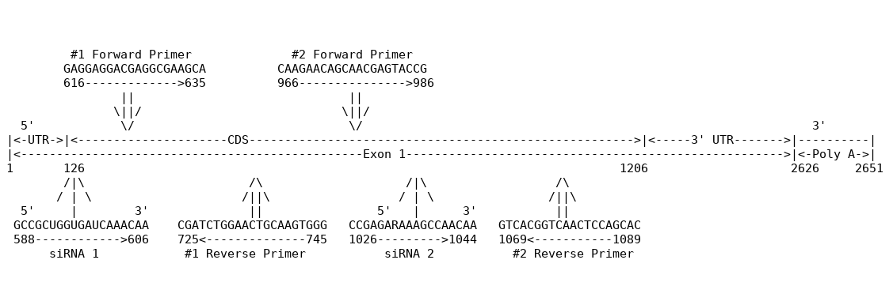
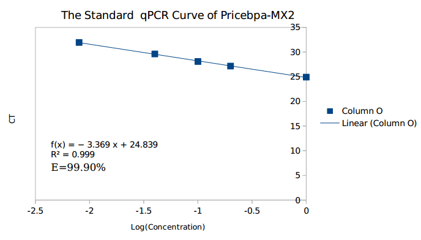
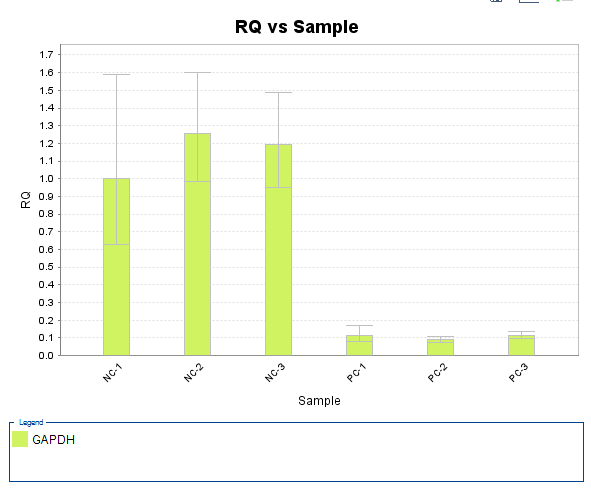
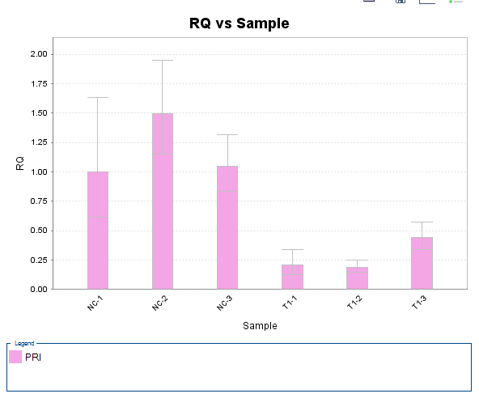
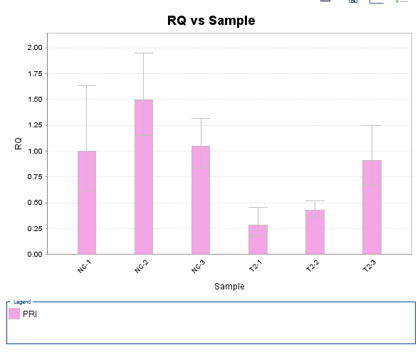

# Use siRNA to knowndown Cebp-alpha

> Yuejian Mo, 11510511

# About Cebp-alpha

| Protein | Gene | Organsim|
|--------|-------|---------|
|CCAAT/enhancer-bingding protein beta | Cebpb | Mouse|

>This intronless gene encodes a transcription factor that contains a basic
leucine zipper (bZIP) domain and recognizes the CCAAT motif in the promoters of target
genes. The encoded protein functions in homodimers and also heterodimers with
CCAAT/enhancer-binding proteins beta and gamma. Activity of this protein can
modulate the expression of genes involved in cell cycle regulation as well as in body
weight homeostasis. [provided by RefSeq, Sep 2014]

# Methods and Materials
+ Choose target gene
+ Design siRNA and qPCR primer
+ Using absolute qPCR to choose better qPCR primer
+ Transfection siRNA to 3T3
+ Isolate RNA & reverse RNA
+ Using relative qPCR to measure the expression of Cebp-alpha

# siRNA and Primer Design

# Real-time PCR, or qPCR
qPCR provide a **simple** and **elegnat** method for determining the **amount of a 
target sequence** that is present in a sample. 

+ Compare with end-point PCR (Traditional PCR + Gel elecrophoresis)
 - Fast: no gel electrophoresis
 - Less pollution: Don't need to open tube

# Absolute qPCR

# Result & Conclusion

# Result & Conclusion

# Result & Conclusion

